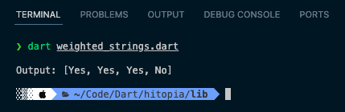
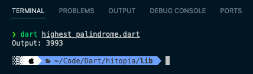
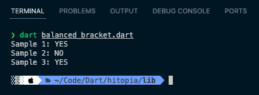

# 📋 HITOPIA - Problem Solving Test

Sebelum mengerjakan HARAP MEMBACA ATURAN di bawah ini!

🚀 ATURAN SUBMIT:

- Terdapat 3 soal Problem Solving dengan score masing-masing di section berikutnya.
- Buat pemanggilan fungsi tiap soal dengan 3 Input berbeda.
- Submit jawaban cukup memasukkan link github/gitlab di field Link GitHub/GitLab pada halaman terakhir form.
- Link GitHub dan GitLab yang disubmit  mencakup 1 repo berisi 3 file kode(3 jawaban) dan screenshot output.
- Batas waktu submit: 24 jam setelah menerima link test.

🤖 ATURAN ROLE & LANGUAGE:

- BE/FE/Fullstack: JS/PHP/Go/Java/C#
- Mobile: Kotlin/Swift/Java/Dart

Jika ditemukan KETIDAKSESUAIAN dengan ATURAN di atas, maka akan mendapat pengurangan poin.

Pertama, sebelum mengerjakan soal tes alangkah baiknya berdoa terlebih dahulu. 🙏

Selamat mengerjakan dan semoga lancar! 👍

---

## 1. Weighted Strings (Score: 20)

Alfabet dari a sampai z memiliki bobot sebesar angka urutannya, misal: a = 1, b = 2, c = 3, ..., z = 26. Bobot sebuah string merupakan penjumlahan bobot dari kesuluruhan karakter.
Contoh: gits = 7 + 9 + 20 + 19 = 55

Sampel:
Input:
Diberikan sebuah string 'abbcccd' dengan queries [1, 3, 9, 8]. Queries digunakan untuk menentukan status dari angka di dalam queries dengan aturan:

1. Apabila angka di queries bernilai sama dengan bobot karakter/substring maka return Yes.
2. Apabila angka di queries bernilai beda dengan bobot karakter/substring maka return No.
Pembobotan substring dan karakter:
a = 1
b = 2
bb = 4
c = 3
cc = 6
ccc = 9
d = 4
Output: ['Yes', 'Yes', 'Yes', 'No']
Penjelasan: Dari pembobotan substring dan karakter yang dimiliki 'abbcccd' maka status dari queries yang ditentukan yaitu ['Yes', 'Yes', 'Yes', 'No'].

Aturan:

1. Jika terdapat karakter yang berulang dan berurutan perlu dirincikan ke dalam bentuk substring dari perulangan pertama hingga n. Contoh: bbccc => b, bb, c, cc, ccc.

Soal:
Buat fungsi untuk menyelesaikan permasalahan Weighted Strings!

Jawaban:

---

## 2. Highest Palindrome (Score: 30)

Kamu memiliki string yang merepresentasikan angka '3943' lalu diberikan sebuah variabel k untuk melakukan replacement karakter sejumlah k pada string agar menjadi bentuk palindrom.

Sampel:
Input:
string: '3943'
k: 1
palindrom:

1. '3943'  => '3993'
2. '3943' => '3443'
Output: '3993'
Penjelasan: Dari bentuk palindrom yang diperoleh maka highest palindrome-nya adalah '3993' dikarenakan 3993 > 3443.

Aturan:

1. Jika dari sebuah string tidak ditemukan bentuk palindrome-nya meski sudah melakukan replacement dan tidak merepresentasikan sebuah angka maka akan mengeluarkan output -1.
2. Tidak boleh menggunakan fungsi bawaan/tools untuk pencarian/filter/sort.
3. Tidak boleh menggunakan looping.
4. Hanya diperkenankan menggunakan rekursif.

Soal:
Buat fungsi yang digunakan untuk menyelesaikan permasalahan Highest Palindrome!

Jawaban:

---

## 3. Balanced Bracket (Score: 50)

Sampe 1:
Input: { [ ( ) ] }
Output: YES
Penjelasan: Setiap braket seimbang, antara braket buka dan braket tutup.
opening : { }
opening : [ ]
opening : ( }

Sampel 2:
Input: { [ ( ] ) }
Output: NO
Penjelasan: String { [ ( ] ) } tidak seimbang untuk karakter yang diapit oleh { dan } yaitu [ ( ] ).

Sampel 3:
Input: { ( ( [ ] ) [ ] ) [ ] }
Output: YES
Penjelasan: Setiap braket seimbang, antara braket buka dan braket tutup, meskipun struktur braket tidak beraturan.

Aturan:

1. Tanda braket yang diperbolehkan sebagai berikut: ( , ) , { , } , atau [ , ].
2. Bracket bisa dipisahkan dengan atau tanpa whitespace.
3. Periksa tanda kurung yang memiliki kecocokan antara braket buka dan braket tutup dengan mengembalikan nilai string YES atau NO.

Soal:

1. Buat fungsi untuk menemukan Balanced Bracket dengan kompleksitas paling rendah!
2. Berapa ukuran kompleksitas kodinganmu? Jelaskan detail kompleksitas jawaban No.3, cantumkan di README Repo!

Jawaban:

1.
- Fungsi isBalanced menggunakan struktur data stack untuk melacak bracket buka yang belum ditutup.
- Iterasi melalui string, dan jika karakter saat ini adalah bracket buka, tambahkan ke stack. Jika karakter adalah bracket tutup, cocokkan dengan bracket buka terakhir di stack.
- Jika semua bracket terbuka dan tertutup dengan benar, dan tidak ada bracket yang belum ditutup, fungsi mengembalikan true. Sebaliknya, mengembalikan false.

2. 
- Kompleksitas Waktu: O(n) - di mana n adalah panjang string s.
- Kompleksitas Ruang: O(n) - karena stack dapat mencapai ukuran n dalam kasus terburuk.

---